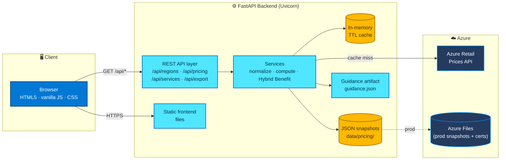
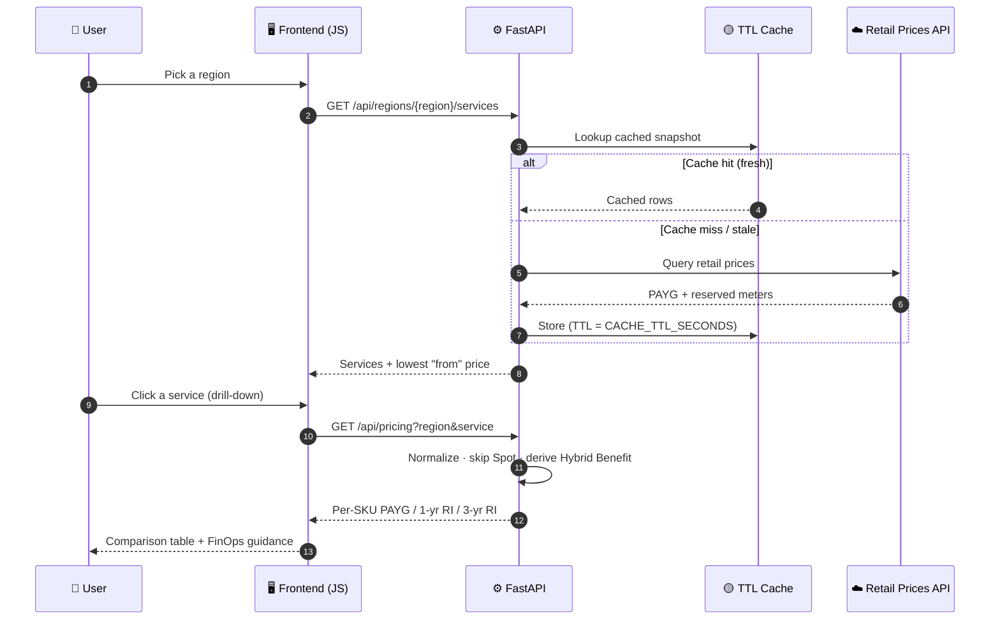
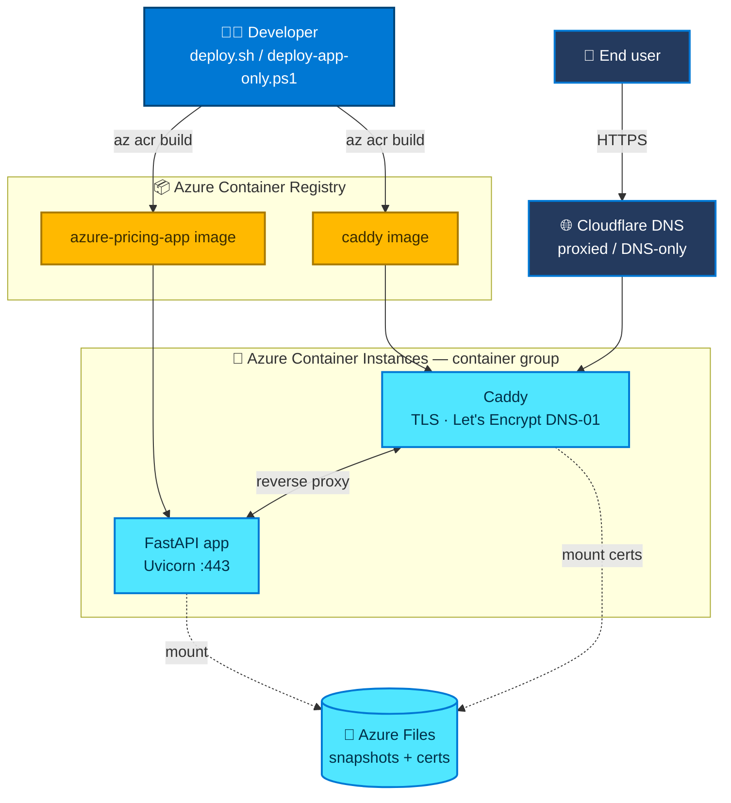

# Azure Pricing Dashboard

A region-first Azure pricing dashboard. Pick a region and see **every** Azure service available
there with its lowest "from" pay-as-you-go price, then drill into any service to compare per-SKU
**pay-as-you-go**, **1-year reserved** and **3-year reserved** pricing — with optional **Azure
Hybrid Benefit** (Windows Server and SQL Server, independent toggles), CSV/XLSX export, and grounded
FinOps guidance.

**Honesty first:** every figure comes straight from the [Azure Retail Prices API][retail]. Missing
prices are shown as an explicit "Not available" — never zero, blank, or fabricated. Hybrid Benefit
prices are *derived* (the API publishes no explicit benefit price) and every derived number is
reproducible from the displayed components.

---

## Architecture



- **backend/** — FastAPI + Uvicorn. Proxies, caches, normalizes, and computes; serves the frontend.
- **frontend/** — Static HTML/CSS/JS, mobile-adaptive, served by FastAPI (and by Caddy in prod).
- **deploy/** — Dockerfile, Caddyfile (Let's Encrypt DNS-01 via Cloudflare), and a re-runnable
  `deploy.sh` that ships a two-container group (Caddy + app) to Azure Container Instances.

See [specs/001-azure-pricing-dashboard/](specs/001-azure-pricing-dashboard) for the full spec, plan,
research, data model, API contract, and quickstart.

### Request workflow — region overview → drill-down



### Deployment topology (production)



---

## Prerequisites

| Tool | Version | Used for |
| --- | --- | --- |
| Python | 3.12+ | Backend (FastAPI + Uvicorn) |
| Azure CLI (`az`) | latest | Build images & deploy to ACI |
| Docker / ACR | — | Container build (via `az acr build`, no local Docker needed) |
| GitHub CLI (`gh`) | optional | Repo automation |

No database, no message broker, no cloud account is needed to **run locally** — the app talks
directly to the public Azure Retail Prices API and caches in memory.

---

## Run locally (WSL / Linux / macOS)

```bash
cd backend
python -m venv .venv && source .venv/bin/activate
pip install -r requirements.txt

# Run the app (serves the API and the frontend at http://localhost:8000)
uvicorn src.main:app --reload --port 8000
```

Then open <http://localhost:8000>, pick a region, and browse.

### Windows (PowerShell)

```powershell
cd backend
python -m venv .venv; .\.venv\Scripts\Activate.ps1
pip install -r requirements.txt
uvicorn src.main:app --reload --port 8000
```

### Configuration

All settings come from environment variables (no secrets in code):

| Variable | Default | Purpose |
| --- | --- | --- |
| `DEFAULT_CURRENCY` | `USD` | Default display currency |
| `CACHE_TTL_SECONDS` | `3600` | Cache freshness window + staleness flag |
| `DATA_DIR` | `data/pricing` | JSON snapshot directory |
| `RETAIL_PRICES_BASE_URL` | `https://prices.azure.com/api/retail/prices` | Upstream API |
| `RETAIL_PRICES_API_VERSION` | `2023-01-01-preview` | Upstream API version |
| `REQUEST_TIMEOUT_SECONDS` | `30` | Upstream request timeout |

---

## Tests

```bash
cd backend
pytest
```

The suite runs fully offline — a fake Retail Prices client serves deterministic rows, so no network
is required. Coverage includes:

- **contract/** — responses validated against [the OpenAPI contract][contract].
- **integration/** — region overview, VM drill-down across regions, export-parity (file == screen).
- **unit/** — "not available" mapping, Hybrid Benefit derivation, export metadata, FinOps guidance.

---

## API

| Method & path | Purpose |
| --- | --- |
| `GET /api/regions` | List selectable regions (dynamic, via a lightweight VM-SKU probe) |
| `GET /api/regions/{armRegionName}/services` | Region-first overview: all services + representative price |
| `GET /api/pricing` | Drill-down: per-SKU PAYG / 1-yr RI / 3-yr RI (+ Hybrid Benefit) |
| `GET /api/services` | Optional typeahead to filter the overview by service name |
| `GET /api/export/{csv\|xlsx}` | Download the current comparison, lossless, with metadata |
| `GET /healthz` | Liveness probe |

`/api/pricing` requires `armRegionName` plus at least one of `serviceName` / `armSkuName` /
`serviceFamily` (otherwise `400`). If the upstream API is unavailable, endpoints return `502` (or an
empty, clearly-flagged result) — never invented prices (FR-013).

---

## FinOps guidance — build-time grounding, runtime reproducibility

Guidance **text** is grounded against Microsoft sources at build/curation time by
[`backend/tools/curate_guidance.py`](backend/tools/curate_guidance.py), which writes the versioned
[`backend/src/guidance/guidance.json`](backend/src/guidance/guidance.json) artifact shipped in the
image. At **runtime** the app only loads that artifact and computes reproducible numbers (e.g.
reserved-instance savings) from the on-screen prices — it never calls any MCP endpoint (FR-011a).

To refresh guidance before a release, regenerate the artifact with current Microsoft Learn content
and commit it:

```bash
python backend/tools/curate_guidance.py
```

---

## Deploy to Azure Container Instances (WSL)

```bash
cp deploy/.env.example deploy/.env   # fill in real values (do NOT commit)
az login                             # in WSL
bash deploy/deploy.sh                # re-runnable: builds images, provisions, deploys
```

The script builds the app and a Cloudflare-enabled Caddy image in ACR, provisions an Azure Files
share for snapshot + certificate persistence, and deploys a two-container group. After it finishes,
point a **DNS-only** Cloudflare A record for your `APP_DOMAIN` at the printed public IP so Caddy can
complete the ACME DNS-01 challenge and obtain a certificate. The Cloudflare API token is passed as a
**secure** environment variable and is never stored in the repo.

[retail]: https://learn.microsoft.com/rest/api/cost-management/retail-prices/azure-retail-prices
[contract]: specs/001-azure-pricing-dashboard/contracts/pricing-api.openapi.yaml
